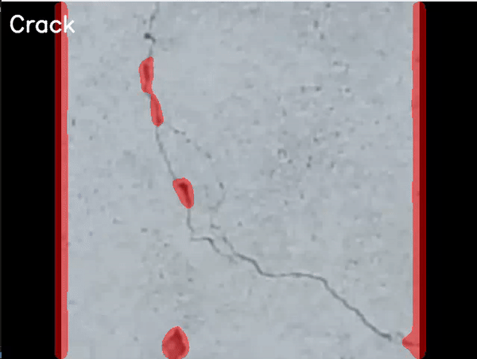

# Building Inspection with Deep Learning
[](./LICENSE.md)&nbsp;
[](https://www.python.org/)&nbsp;
[](https://pytorch.org/)&nbsp;
[](https://matplotlib.org/)&nbsp;
[](https://numpy.org/)&nbsp;

## Overview

The goal of this project is the detection of defects in facades of buildings.
The idea behind the project is that you could fly over each side of a building and automatically detect the defects.
In this project Pytorch is used to train the VGG16 model with a Wall Crack Dataset from the Utah State University.
In the next step the model validates if the video input has a wall crack in it or not. If there is a wall crack a mask gets overlayed over the video which marks the crack.
For performance enhancement only every 10th frame is used in the evaluation.

<div align="center">
  </img>
</div>


## Requirements

* Python => 3.10
* Python Libraries: `tkinter` `numpy` `matplotlib` `opencv-python` `torch` `torchvision` `alive-progress`

### How to get the pretrained Model, not necessary if you want to train it yourself

It is safed with Git LFS so it won't be the right file when you run git clone
* Download it via Github => [Model](./src/Model/VGG16_v2-OCT_Building_half_dataset.pt)
* Get it via [Nextcloud](https://nextcloud.th-deg.de/s/RAZ4D4aNRns3Axo)

### Database for model training

[SDNET2018: A concrete crack image dataset for machine learning applications](https://digitalcommons.usu.edu/all_datasets/48/)

## Clone this repository

```
git clone https://github.com/96korbi/BuildingInspectionDeepL
```

On windows it could be neccessary to run this command as administrator to install PyTorch
```
pip install -r requirements.txt
```

Only neccessary for model training to visualize the images
```
apt install python3-tk
```

## Run detection

Run in directory (src\Detection)

```
python detection.py
```

## Run model training (only tested with Linux OS (Ubuntu 22.10))

Run in directory (src\Model)

```
python Pytorch.py
```
More details in the WikiPage [How-to: Add more classes to the model](https://github.com/96korbi/BuildingInspectionDeepL/wiki/How-to:-Add-more-classes-to-the-model)

## Sources

* Maguire, M., Dorafshan, S., & Thomas, R. J. (2018). SDNET2018: A concrete crack image dataset for machine learning applications. Utah State University. https://doi.org/10.15142/T3TD19

## Usefule Links
* [Crash Course Deep Learning](https://towardsdatascience.com/a-beginners-guide-to-deep-learning-ed41ac75c4e5)
* [VGG16 transfer learning pytorch](https://www.kaggle.com/code/carloalbertobarbano/vgg16-transfer-learning-pytorch)
* [VGG16 transfer learning keras](https://towardsdatascience.com/transfer-learning-with-vgg16-and-keras-50ea161580b4)
* [Convolutional Neural Networks](https://www.mathworks.com/discovery/convolutional-neural-network-matlab.html)
* [Guide to CNN](https://towardsdatascience.com/a-comprehensive-guide-to-convolutional-neural-networks-the-eli5-way-3bd2b1164a53)
* [ImageNet](https://image-net.org/)
* [Grad-CAM](http://gradcam.cloudcv.org/)


